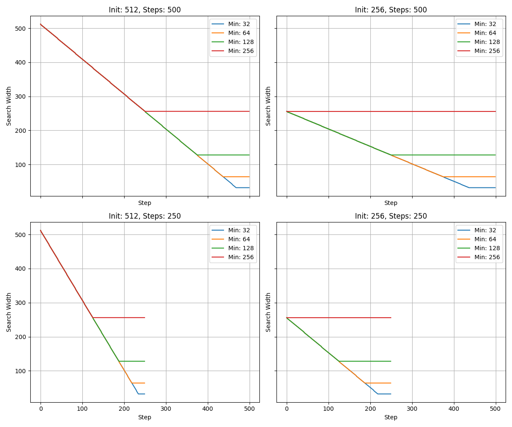

# 🔥 Bimodal Attack: Joint GCG + PGD on Vision-Language Models

This repository implements joint multimodal adversarial attacks (GCG + PGD) on vision-language models such as **LLaVA**, **LLaVA-RC** (with RCLIP), and **Gemma-3-4b-it**. Our code extends and adapts the work from [nanoGCG](https://github.com/GraySwanAI/nanoGCG) to support both **textual** and **visual** perturbations in a unified pipeline.

---

## 🚀 Attacks Supported

We support the following attack modes:

- **PGD-only**: Perturb the input image while keeping the prompt fixed.
- **GCG-only**: Optimize textual suffixes to maximize model misalignment.
- **Joint PGD + GCG**: Optimize both image and text jointly, with optional interleaved evaluation.

You can configure these modes using the `--pgd_attack` and `--gcg_attack` flags. Using `--joint_eval` will evaluate the GCG candidates using the perturbed image, allowing for a more robust attack.

---

## 🧠 Supported Models

- [`google/gemma-3-4b-it`](https://huggingface.co/google/gemma-3-4b-it)
- [`llava-hf/llava-1.5-7b-hf`](https://huggingface.co/llava-hf/llava-1.5-7b-hf)
- `llava-rc`: LLaVA 1.5 with a **robust CLIP (RCLIP ViT-L)** vision encoder

---

## 📦 Installation

This project uses a `conda` environment. To get started:

1. Create and activate the environment:
```bash
conda env create -f environment.yml
conda activate multimodal-attack
```

2. (Optional) If you're using LLaVA-based models, install `flash-attn` for faster attention:
```bash
pip install flash-attn --no-build-isolation
```

---

## 🧪 Running Attacks

### Run a full experiment
```bash
bash run_experiments.sh
```

This will launch a joint PGD+GCG attack using LLaVA-RC with 600 steps and save results in `experiments/`.

### Run a single config manually
```bash
python experiments.py \
    --name "Gemma - PGD + GCG" \
    --num_steps 500 \
    --search_width 256 \
    --dynamic_search True \
    --min_search_width 32 \
    --pgd_attack True \
    --gcg_attack True \
    --alpha "4/255" \
    --eps "64/255" \
    --debug_output False \
    --joint_eval True \
    --model "gemma"
```

### Run all tests (quick mode, 5 steps per attack)
```bash
bash run_tests.sh
```

---

## 📊 Evaluation

Run evaluations of `success@k` (i.e., how often adversarial generations are classified as "unsafe" by a moderation model like **Llama Guard**):

```bash
bash run_evaluation.sh
```

This will generate per-run verdicts and aggregate plots in each experiment folder (e.g. `experiments/exp42/evaluation_k50/`).

---

## 🔍 Dynamic Search Width in GCG

To reduce the computational burden of the **loss computation step**, especially when images are used in joint PGD+GCG attacks, we support a **dynamic reduction of the GCG search width** across optimization steps.

When `--dynamic_search` is enabled, the effective search width decreases linearly as the attack progresses:

```python
search_width_i = max(min_search_width, search_width * (1 - step / num_steps))
```

This means that earlier iterations will explore a wider space of suffix candidates, while later iterations will focus on fewer candidates—making the **forward passes for loss evaluation cheaper** and avoiding long bottlenecks as the prompt stabilizes. This is especially useful to implement the joint attack.

📈 Example: the plot below compares how different configurations of `search_width` and `min_search_width` evolve over 500 steps:




---

## 🧪 Dataset: AdvBench

We use prompts from `data/advbench/harmful_behaviors.csv`, a benchmark of harmful behavior goals and expected target completions, to evaluate the attack's effectiveness.

---

## 📁 Output Files

Each experiment creates a folder under `experiments/expXX/`, e.g. `exp69/`, containing the full results of the attack. Below is a breakdown of the files and their meaning, using actual outputs from a successful run:

### Core Summary Files
- **`parameters.csv`**: Configuration used for the run (e.g. 600 steps, LLaVA-RC, joint attack, α=4/255, ε=64/255)
- **`summary.csv`**: Final summary including average best loss and time statistics across all prompts:
  ```
  Average Best Loss: 0.0673
  Std Best Loss: 0.0452
  Average Total Time per Iteration: 23.36s
  ```

- **`losses.csv`**: Loss at each iteration for each run
- **`losses_aggregated.png`**: Line plot visualizing loss curves across all 10 prompts

### Generation and Suffix Tracking
- **`details.csv`**: Full list of adversarial suffixes and corresponding generations per iteration
- **`best_strings.txt`**: The best suffix found for each prompt (e.g. `Run 6: whilst Never referencingANT:`' Output " Sure relativ...`)

### Timing Information
- **`times.csv`**: Time spent on gradient computation, PGD step, sampling, and loss computation at each iteration

### Images
- **`images_1/` to `images_10/`**: Adversarial images saved at each iteration (if `--pgd_attack=True`)

### Evaluation Outputs
- **`evaluation_k*/`**: Output of moderation evaluations using Llama Guard at different sampling values of *k*:
  - `evaluation_k5/overall.txt`: 
    ```
    Successful runs: 10/10
    Success@5: 10/10
    ```
  - `evaluation_k5/summary.csv`: Unsafe generations found for each prompt at k=5
  - `evaluation_k5/run_N.txt`: Logs verdicts and text for each generation of run N

## ✨ Credits

This project is based on and adapted from:
- [nanoGCG (GraySwanAI)](https://github.com/GraySwanAI/nanoGCG)

We extend their framework with:
- PGD image perturbations
- Multimodal embedding fusion
- Robust vision encoder integration (e.g., RCLIP) and Gemma integration
- Evaluation tooling using moderation models and success@k

---

📚 This work was conducted as the semester **Research Project** of the Master's in Computer Science – Cybersecurity at EPFL.

👤 **Author**: [Daniel López Gala](https://www.linkedin.com/in/daniel-lopezgala/)  
🏛️ **Laboratory**: [LIONS – Laboratory for Information and Inference Systems](https://www.epfl.ch/labs/lions/)  
👨‍🏫 **Supervision**: Elías Abad Rocamora and Prof. Volkan Cevher

---

## 📄 License

For academic use only.
